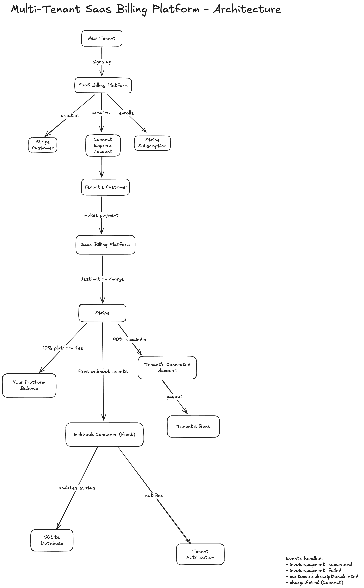

# Multi-Tenant SaaS Billing Platform

A production-grade billing platform built with Stripe, demonstrating 
multi-tenant payment infrastructure using Stripe Connect, Stripe Billing, 
and webhook event handling.

## Why I Built This

I have six years of experience in technical and implementation roles 
in fintech and cloud SaaS, working toward a Solutions Architect role 
at a payments company. I built this project to demonstrate depth of 
understanding in payment infrastructure design, going beyond surface 
level API knowledge to building something production-grade from scratch.

Every architectural decision in this project was deliberate — each 
choice has a reason and a tradeoff.

---

## What This Platform Does

This platform enables businesses (tenants) to onboard, receive payments 
from their customers, and manage subscriptions — all powered by Stripe.

**As the platform owner you:**
- Charge tenants a monthly subscription fee (Starter €29, Pro €79, Enterprise €199)
- Take a 10% application fee on every payment processed through the platform
- Never touch sensitive card data or KYC documents — Stripe handles both

**As a tenant you:**
- Onboard via Stripe Connect Express — Stripe handles identity verification
- Receive payments from your customers routed directly to your connected account
- Manage your subscription plan with proration on upgrades

---

## Architecture



---

## Key Technical Decisions

| Decision | Choice | Why |
|----------|--------|-----|
| Connect account type | Express over Custom | Stripe handles KYC and compliance |
| Payment flow | Destination charges | Single API call handles fee deduction and routing |
| Database | SQLite | Right-sized for portfolio — PostgreSQL in production |
| Update order | Stripe before database | Stripe is the source of truth |
| Webhook architecture | Flask + signature verification + idempotency | Secure, reliable event processing |
| Currency | EUR end-to-end | Eliminates FX conversion fees |

---

## Project Structure
```
stripe-saas-platform/
├── .env                    # API keys and Price IDs (never committed)
├── database.py             # Database schema initialisation
├── setup_products.py       # Creates Stripe Product and pricing tiers
├── setup_tenants.py        # Tenant onboarding — creates Stripe Customers
├── connect.py              # Stripe Connect Express account setup
├── payments.py             # Destination charge processing
├── subscriptions.py        # Subscription lifecycle management
├── webhooks.py             # Flask webhook consumer
├── failure_handling.py     # Card declines, dunning, 3DS simulation
├── main.py                 # Platform entry point
└── architecture.png        # System architecture diagram
```

---

## Setup

### Prerequisites
- Python 3.12+
- Stripe account (test mode)
- Stripe CLI

### Installation

```bash
git clone https://github.com/yourusername/stripe-saas-platform
cd stripe-saas-platform
pip install stripe flask python-dotenv
```

### Configuration

Create a `.env` file with your Stripe keys:
```
STRIPE_SECRET_KEY=sk_test_...
STARTER_PRICE_ID=price_...
PRO_PRICE_ID=price_...
ENTERPRISE_PRICE_ID=price_...
STRIPE_WEBHOOK_SECRET=whsec_...
```

### Running the Platform

```bash
# Step 1 — Initialise and set up
python main.py

# Step 2 — Set up Connect accounts
python connect.py

# Step 3 — Enroll tenants on subscriptions
python subscriptions.py

# Step 4 — Start webhook consumer (Terminal 1)
python webhooks.py

# Step 5 — Start Stripe CLI (Terminal 2)
stripe listen --forward-to localhost:5000/webhook --forward-connect-to localhost:5000/webhook

# Step 6 — Test failure handling
python failure_handling.py
```

---

## What I Learned Building This

The most valuable thing wasn't the code — it was the decisions. 
Choosing Express over Custom accounts, destination charges over 
separate charges and transfers, EUR-to-EUR architecture to eliminate 
FX fees. Each decision has a reason and a tradeoff.

I also hit real problems along the way — idempotency key expiry 
causing duplicate Stripe objects across sessions, German KYC 
verification requiring specific test tokens that took real 
debugging to discover, currency mismatch between platform and 
connected accounts adding unexpected conversion fees. 

---

## Test Tenants

| Tenant ID | Company | Plan | Monthly Fee |
|-----------|---------|------|-------------|
| tenant_001 | Acme Corp | Pro | €79 |
| tenant_002 | GlobalTech Ltd | Pro (upgraded) | €79 |
| tenant_003 | Nova Systems | Enterprise (cancelled) | €199 |
| tenant_004 | EuroTech GmbH | Starter | €29 |

---

## Built With

- [Stripe Python SDK](https://github.com/stripe/stripe-python)
- [Flask](https://flask.palletsprojects.com/)
- [SQLite](https://www.sqlite.org/)
- [Stripe CLI](https://stripe.com/docs/stripe-cli)
